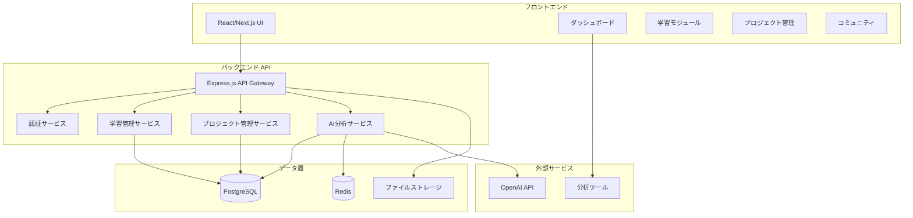

# 設計文書

## 概要

AI活用BPR成長支援アプリは、学習管理、実践プロジェクト管理、AI支援分析、進捗可視化、コミュニティ機能を統合したWebアプリケーションです。ユーザーが段階的にBPRスキルを習得し、実際の業務改善を実践できる環境を提供します。

## アーキテクチャ

### システム全体構成



### 技術スタック

- **フロントエンド**: React 18, Next.js 14, TypeScript, Tailwind CSS
- **バックエンド**: Node.js, Express.js, TypeScript
- **データベース**: PostgreSQL (メインデータ), Redis (キャッシュ・セッション)
- **AI統合**: OpenAI API, LangChain
- **認証**: NextAuth.js
- **デプロイ**: Vercel (フロント), Railway/Render (バック)

## コンポーネントとインターフェース

### 1. 学習管理コンポーネント

**LearningContentManager**
- 学習コンテンツの配信と進捗管理
- 適応的学習パス生成
- スキル評価とレベル判定

```typescript
interface LearningContent {
  id: string;
  title: string;
  type: 'video' | 'article' | 'exercise' | 'case-study';
  difficulty: 'beginner' | 'intermediate' | 'advanced';
  aiTopics: string[];
  estimatedTime: number;
  prerequisites: string[];
}

interface UserProgress {
  userId: string;
  contentId: string;
  status: 'not-started' | 'in-progress' | 'completed';
  completionRate: number;
  skillPoints: number;
  lastAccessed: Date;
}
```

### 2. AI分析エンジン

**ProcessAnalyzer**
- 業務プロセスの自動分析
- ボトルネック特定
- 改善提案生成

```typescript
interface ProcessAnalysis {
  processId: string;
  bottlenecks: Bottleneck[];
  inefficiencies: Inefficiency[];
  improvementSuggestions: ImprovementSuggestion[];
  aiConfidenceScore: number;
}

interface ImprovementSuggestion {
  id: string;
  title: string;
  description: string;
  expectedImpact: 'low' | 'medium' | 'high';
  implementationComplexity: 'low' | 'medium' | 'high';
  aiTools: string[];
  estimatedROI: number;
}
```

### 3. プロジェクト管理コンポーネント

**BPRProjectManager**
- プロジェクトライフサイクル管理
- タスク管理と進捗トラッキング
- 成果測定

```typescript
interface BPRProject {
  id: string;
  userId: string;
  title: string;
  description: string;
  currentProcess: ProcessDefinition;
  targetProcess?: ProcessDefinition;
  status: 'planning' | 'analysis' | 'design' | 'implementation' | 'evaluation';
  metrics: ProjectMetrics;
  createdAt: Date;
  updatedAt: Date;
}

interface ProjectMetrics {
  timeReduction?: number;
  costSaving?: number;
  qualityImprovement?: number;
  customerSatisfaction?: number;
}
```

### 4. 可視化コンポーネント

**ProgressDashboard**
- 学習進捗の可視化
- プロジェクト成果の表示
- スキルレベルの追跡

```typescript
interface DashboardData {
  learningProgress: {
    completedCourses: number;
    totalCourses: number;
    currentSkillLevel: number;
    skillBreakdown: SkillArea[];
  };
  projectProgress: {
    activeProjects: number;
    completedProjects: number;
    totalImpactScore: number;
  };
  achievements: Achievement[];
}
```

## データモデル

### ユーザー関連

```sql
CREATE TABLE users (
  id UUID PRIMARY KEY DEFAULT gen_random_uuid(),
  email VARCHAR(255) UNIQUE NOT NULL,
  name VARCHAR(255) NOT NULL,
  role VARCHAR(50) DEFAULT 'learner',
  skill_level INTEGER DEFAULT 0,
  created_at TIMESTAMP DEFAULT NOW(),
  updated_at TIMESTAMP DEFAULT NOW()
);

CREATE TABLE user_skills (
  id UUID PRIMARY KEY DEFAULT gen_random_uuid(),
  user_id UUID REFERENCES users(id),
  skill_area VARCHAR(100) NOT NULL,
  level INTEGER DEFAULT 0,
  experience_points INTEGER DEFAULT 0,
  updated_at TIMESTAMP DEFAULT NOW()
);
```

### 学習コンテンツ

```sql
CREATE TABLE learning_contents (
  id UUID PRIMARY KEY DEFAULT gen_random_uuid(),
  title VARCHAR(255) NOT NULL,
  content_type VARCHAR(50) NOT NULL,
  difficulty VARCHAR(20) NOT NULL,
  content_data JSONB NOT NULL,
  ai_topics TEXT[],
  estimated_time INTEGER,
  created_at TIMESTAMP DEFAULT NOW()
);

CREATE TABLE user_progress (
  id UUID PRIMARY KEY DEFAULT gen_random_uuid(),
  user_id UUID REFERENCES users(id),
  content_id UUID REFERENCES learning_contents(id),
  status VARCHAR(20) DEFAULT 'not-started',
  completion_rate DECIMAL(5,2) DEFAULT 0,
  skill_points INTEGER DEFAULT 0,
  started_at TIMESTAMP,
  completed_at TIMESTAMP,
  updated_at TIMESTAMP DEFAULT NOW()
);
```

### BPRプロジェクト

```sql
CREATE TABLE bpr_projects (
  id UUID PRIMARY KEY DEFAULT gen_random_uuid(),
  user_id UUID REFERENCES users(id),
  title VARCHAR(255) NOT NULL,
  description TEXT,
  current_process JSONB,
  target_process JSONB,
  status VARCHAR(20) DEFAULT 'planning',
  metrics JSONB,
  created_at TIMESTAMP DEFAULT NOW(),
  updated_at TIMESTAMP DEFAULT NOW()
);

CREATE TABLE process_analyses (
  id UUID PRIMARY KEY DEFAULT gen_random_uuid(),
  project_id UUID REFERENCES bpr_projects(id),
  analysis_data JSONB NOT NULL,
  ai_confidence_score DECIMAL(3,2),
  created_at TIMESTAMP DEFAULT NOW()
);
```

## エラーハンドリング

### API エラー処理

```typescript
class APIError extends Error {
  constructor(
    public statusCode: number,
    public message: string,
    public code?: string
  ) {
    super(message);
  }
}

const errorHandler = (error: APIError, req: Request, res: Response, next: NextFunction) => {
  const { statusCode = 500, message, code } = error;
  
  res.status(statusCode).json({
    success: false,
    error: {
      message,
      code,
      ...(process.env.NODE_ENV === 'development' && { stack: error.stack })
    }
  });
};
```

### AI API エラー処理

- OpenAI API レート制限対応
- フォールバック機能（AI分析失敗時の代替処理）
- ユーザーフレンドリーなエラーメッセージ

## テスト戦略

### 1. 単体テスト
- Jest + React Testing Library (フロントエンド)
- Jest + Supertest (バックエンド API)
- AI分析ロジックのモックテスト

### 2. 統合テスト
- API エンドポイントテスト
- データベース操作テスト
- 外部サービス統合テスト

### 3. E2Eテスト
- Playwright による主要ユーザーフローテスト
- 学習進捗管理フローテスト
- プロジェクト作成から完了までのフローテスト

### 4. パフォーマンステスト
- AI分析処理の応答時間測定
- 大量データ処理時の性能評価
- 同時ユーザー負荷テスト

### テストデータ管理

```typescript
// テスト用のモックデータ生成
const createMockUser = (): User => ({
  id: 'test-user-1',
  email: 'test@example.com',
  name: 'テストユーザー',
  skillLevel: 1,
  createdAt: new Date()
});

const createMockBPRProject = (): BPRProject => ({
  id: 'test-project-1',
  userId: 'test-user-1',
  title: 'テスト業務改善プロジェクト',
  description: 'テスト用のプロジェクト説明',
  status: 'planning',
  createdAt: new Date()
});
```